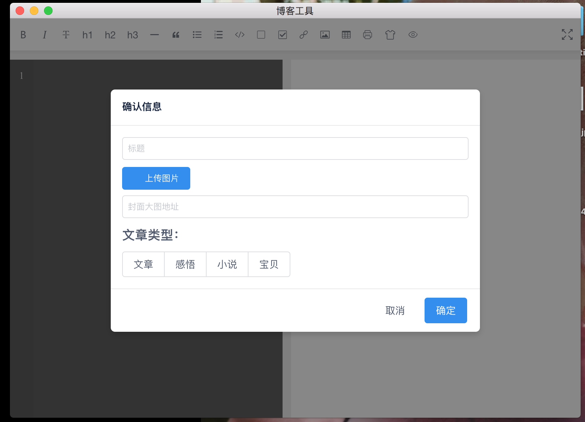

# 博客开发工具


## 初衷

博客的建立运用到了 [Hexo](https://hexo.io/zh-cn/) 工具，但是在书写的过程中，发现只能在本地的电脑里书写。换一台电脑可能环境不同了，或着源文件没有了导致不能在其他的地方写博客。这也许是个人博客网站的一个弊端。

作为一名爱折腾的前端的工程师，运用 Koa2 ，做了一个可视化的工具，并发布到自己的个人服务器上。(阿里云)。这样，自己就可以在任何一台有网的机器上书写博客。

## 技术体系

```
"dependencies": {
	"koa-bodyparser": "^4.2.1",
	"koa-multer": "^1.0.2",
	"koa-router": "^7.4.0",
	"koa-static": "^5.0.0",
	"koa2": "^2.0.0-alpha.7",
	"ssh2": "^0.6.1",
	"vue-highlightjs": "^1.3.3",
	"vue-meditor": "^0.5.0"
},
```

## 实例图


## 工具二次开发说明

注意根目录文件下的 `ssh.js` 文件, 注释的地方就是自己要配置的地方。

```
const Client = require('ssh2').Client;

var conn = new Client();

conn.on('ready', function() {
  console.log('Client :: ready');
  // 这里要执行 linux 命令 拉取代码然后执行其他的操作
  conn.exec('********', function(err, stream) {
    if (err) throw err;
    stream.on('close', function(code, signal) {
      console.log('Stream-close-code: ' + code + ', signal: ' + signal);
      conn.end();
    }).on('data', function(data) {
      console.log('STDOUT: ' + data);
    })
  });
}).connect({
  host: '', // 这里是服务器的host
  username: '', // 服务器的账号
  password: '' // 服务器的密码
});
```
```
"scripts": {
    "dev": "webpack-dev-server --inline --progress --config build/webpack.dev.conf.js",
    "start": "npm run dev",
    "server": "supervisor server",
    "build": "node build/build.js",
    "up": "node ./ssh.js"
  },
```
这里要注意，执行命令的地方 `npm run up` 当你配置了你服务的相关信息后，在 `****` 中配置了你想要执行的 linux 操作，这里的操作一般指你执行命令 `npm run up` 后文件应该压缩或者转义，已达到自动化构建的目的。

在根目录 `npm run dev` 即可执行本地的开发环境，部署上线需要打包 `npm run build` 后，可 nginx 访问。

 ## 开源的想法
 
其实这就是一个很简单的小工具，谈不上有多大开源的意义。放到Github上的意思就是一方面做一个积累，以后如果哪一天有在想做的冲动可以不必要重复的工作。

